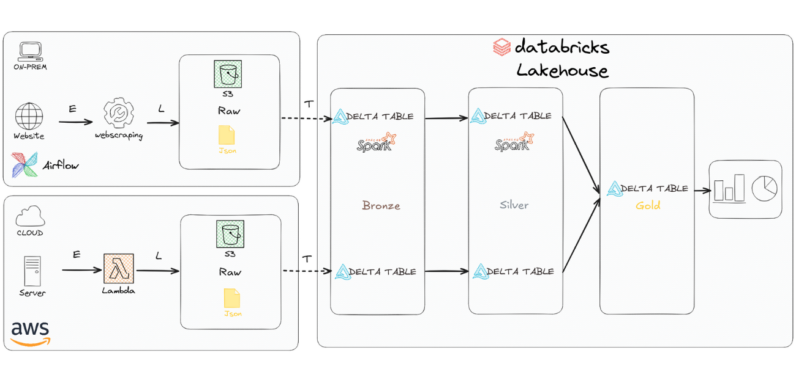

# solar_databricks

Repositório de orquestração e pipelines Databricks que integram séries de geração solar com dados meteorológicos. 
Este projeto centraliza notebooks e jobs que fazem ingestão (_bronze_), preparação (_silver_) e modelagem (_gold_) para experimentos e automação.

## Repositórios Relacionados
- Dados de Energia Solar: https://github.com/lksprado/Solar
- Dados Climáticos: https://github.com/lksprado/openweather

Use este repositório como “cola” entre os dois acima: consome clima (OpenWeather) e combina com geração/experimentos (Solar) dentro de uma pipeline executável em Databricks.

## Estrutura do Projeto
- `solar_clima_pipeline/_silver/`
  - Notebooks de preparação de dados na camada Silver
- `solar_clima_pipeline/gold/solar_and_weather_model.py`
  - Modelo final com dados cruzados

## Visualização

### Análises
 

 

 